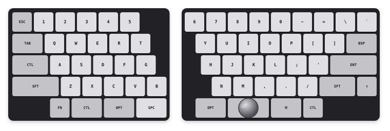
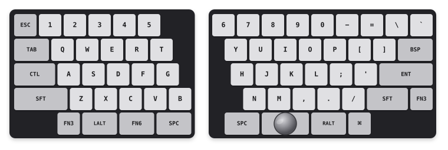
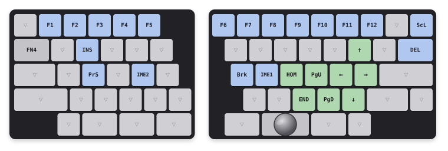
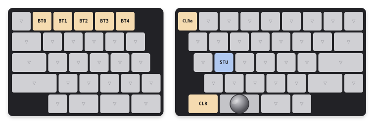
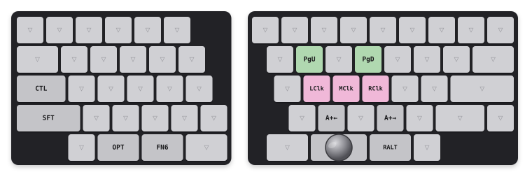
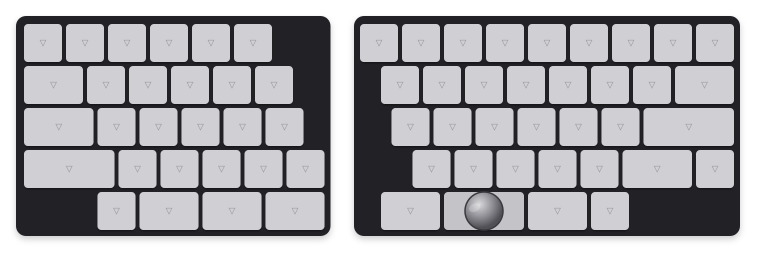
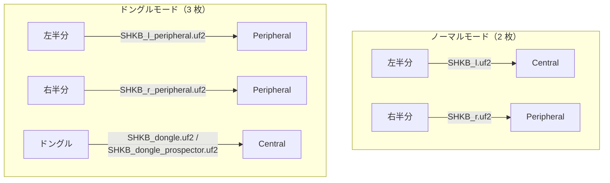

# SHKB

HHKB レイアウトをベースにした 62 キーの左右分割キーボードです。右半分にトラックボール（PMW3610）を搭載しており、ZMK ファームウェアで動作します。

---

## 概要

| 項目 | 内容 |
|------|------|
| キー数 | 62 キー（左 28・右 34） |
| キーピッチ | 17mm |
| マイコン | Seeed Studio XIAO nRF52840 |
| トラックボール | PMW3610, 19mmトラックボール |
| ファームウェア | ZMK v0.3 |
| 接続 | BLE 無線 / USB（ドングル経由） |

---

## レイアウト



---

## ハードウェア

### マイコン
Seeed Studio XIAO nRF52840 を各半分に 1 枚ずつ使用します。ドングルモードではさらに 1 枚追加します。

### キーマトリクス
各半分 7 本の GPIO ピンを使ったチャーリープレックス配線です。ダイオードレスで省ピン接続を実現しています。

### トラックボール
右半分に PMW3610 センサーを SPI で接続します。

- インターフェース: SPI（SCK: P1.13 / MOSI+MISO: P1.15 / CS: D9）
- 割り込みピン: D7
- ドライバ: [badjeff/zmk-pmw3610-driver](https://github.com/badjeff/zmk-pmw3610-driver)

### バッテリー
各半分に LiPo バッテリーを接続可能です。電圧分圧は R_top = 1 MΩ / R_bottom = 510 kΩ（P0.31/AIN7 使用）。

各半分には物理スイッチがあり、バッテリーの接続・切り離しを行えます。USB 接続の有無とスイッチの ON/OFF の組み合わせにより、以下の 4 状態になります。

| 状態 | USB 接続 | 物理スイッチ | バッテリー充放電 | XIAO BLE の駆動 |
|:---:|:---:|:---:|------|------|
| ① | あり | ON | 充電される | USB 電源で駆動 |
| ② | あり | OFF | 充電されない（切り離し） | USB 電源で駆動 |
| ③ | なし | ON | 放電される | バッテリー電源で駆動 |
| ④ | なし | OFF | 充放電なし（完全切り離し） | 停止 |

- **状態①（USB あり・スイッチ ON）**: USB 給電でマイコンが駆動し、バッテリーも充電されます。
- **状態②（USB あり・スイッチ OFF）**: バッテリーが切り離されるため充電されません。USB 給電は BAT 端子を経由しないため、マイコンは USB 電源で駆動します。「バッテリーを充電せずに USB で使いたい」場合に使用します。
- **状態③（USB なし・スイッチ ON）**: バッテリーのみで駆動し、放電が進みます。
- **状態④（USB なし・スイッチ OFF）**: バッテリーが完全に切り離され、放電なし。長期保管に最適です。

> この配線ではスイッチ OFF ＝ バッテリー完全切り離しとなります。USB 接続中にスイッチを OFF にしてもマイコンは動作しますが、充電はされません。充電したいときは必ずスイッチを ON にしてください。

#### バッテリー取り扱い上の注意

LiPo（リチウムポリマー）バッテリーは扱いを誤ると膨張・発火の危険があります。以下を守ってください。

- **満充電のまま放置しない**: フル充電状態で長期間放置すると電圧が自然に上昇し、バッテリーが膨張・発火する恐れがあります。しばらく使わない場合は状態④（USB なし・スイッチ OFF）にして保管し、充電したままキーボードを使わずに放置しないでください。
- **長期保管は 30〜50%（1 セル 3.7〜3.9V 程度）で**: 1 ヶ月以上使わない場合は、満充電・完全放電ではなく 30〜50% 程度まで充電した状態で保管するのが安全です。数ヶ月に一度は電圧を確認してください。
- **充電中は目を離さない**: 特に初回充電時や長期保管後の充電時は、異常な発熱・膨張がないか確認しながら充電し、異常を感じたら直ちに中止してください。
- **過放電させない**: バッテリー残量が極端に低い状態（マイコンが動作しなくなるレベル）まで使い切らないでください。過放電はセルの劣化・破損につながります。
- **物理的な損傷を避ける**: バッテリーをスイッチのピンや鋭利な端子で傷つけない、強く圧迫・落下させないよう注意してください。膨らみ・変形・異臭がある場合は使用を中止してください。
- **極性とコネクタ**: 接続時にコネクタの極性（+/-）を逆にしないでください。逆接続は破損や発火の原因になります。
- **廃棄時**: 端子をテープ等で絶縁してから、バッテリー回収ボックスなど所定の方法で廃棄してください。

---

## 接続モード

### ノーマルモード（ドングルなし）

```
左半分（Central）  ←──BLE──→  右半分（Peripheral）
     │
    BLE
     │
   ホスト PC
```

左半分がセントラルとなり、キーマップ処理とトラックボールイベントの受信を担います。右半分はペリフェラルとして動作します。

### ドングルモード

```
左半分（Peripheral）  ─┐
                       ├──BLE──→  ドングル（Central）── USB ──→ ホスト PC
右半分（Peripheral）  ─┘
```

両半分をペリフェラルにし、ドングルをセントラルとして USB 接続します。ドングルには XIAO BLE 単体か、LCD 付き Prospector キャリアボードが使用できます。

---

## レイヤー構成

| # | 名前 | 用途 |
|---|------|------|
| 0 | **mac** | Mac 向けベースレイヤー（⌘キー） |
| 1 | **win** | Windows 向けベースレイヤー（CTLキー） |
| 2 | **iPad** | iPad 向けベースレイヤー（暫定的に mac 配列を流用） |
| 3 | **Function** | FN レイヤー（F1〜F12・ナビゲーション） |
| 4 | **Bluetooth** | BT プロファイル切り替え |
| 5 | **Mouse** | AutoMouse（トラックボール移動で自動起動） |
| 6 | **Scroll** | トラックボールをスクロールにリマップ |

凡例：`▽` = 下位レイヤーに透過 / <span style="background:#b0c8f0;padding:0 4px">青</span> = ファンクション / <span style="background:#b0d8b0;padding:0 4px">緑</span> = ナビゲーション / <span style="background:#f5dbb0;padding:0 4px">橙</span> = Bluetooth / <span style="background:#f0b8d8;padding:0 4px">桃</span> = マウス

---

### Layer 0 – mac

Layer 0 が Mac 用ベースレイヤーです。起動時はこのレイヤーが選択されます。ホームロウ左端が CTL、左右サムの Alt キーはどちらも OPT、右端は ⌘。


---

### Layer 1 – win

Layer 1 が Windows 用ベースレイヤーです。ホームロウ左端が CTL、左右サムの Alt キーは LALT / RALT、右端は ⌘。



---

### Layer 2 – iPad

iPad 接続用のベースレイヤーです。キー配列は暫定的に Layer 0（mac）をそのまま流用しています。Bluetooth レイヤーの `BT4` で BT_SEL 4 への切り替えと同時にこのレイヤーへ移行します。


---

### Layer 3 – Function（FN）

FN キー（または ↑ キー）を押している間有効になるレイヤーです。F1〜F12・ナビゲーション・IME 切り替えを収録しています。TAB 位置の `FN4` で Bluetooth レイヤーへ移行します。



---

### Layer 4 – Bluetooth

BT プロファイル切り替えレイヤーです。BT0/1 は Mac モード、BT2/3 は Win モード、BT4 は iPad モードに同時切り替えするマクロです。`CLRa` で全プロファイルをクリアします。



---

### Layer 5 – Mouse（AutoMouse）

トラックボールを動かすと自動起動（5 秒タイムアウト）するレイヤーです。J/K/L でクリック、左サムの `FN6` で Scroll レイヤーへ移行します。



---

### Layer 6 – Scroll

トラックボールの XY 移動をホイールスクロールにリマップします（スケーリング比 1:8）。全キーが `▽` 透過です。



---

## ビルド

GitHub Actions で自動ビルドされます。生成される `.uf2` ファイルは以下の名前になります。

| ファイル名 | 用途 |
|------------|------|
| `SHKB_l.uf2` | ノーマルモード 左半分（Central） |
| `SHKB_r.uf2` | ノーマルモード 右半分（Peripheral） |
| `SHKB_l_peripheral.uf2` | ドングルモード 左半分 |
| `SHKB_r_peripheral.uf2` | ドングルモード 右半分 |
| `SHKB_dongle.uf2` | ドングル（XIAO BLE） |
| `SHKB_dongle_prospector.uf2` | ドングル（Prospector / LCD付き） |
| `settings_reset.uf2` | 設定リセット |

リポジトリに push するか、Actions タブから手動実行（`workflow_dispatch`）でビルドできます。

---

## ファームウェア書き込み

XIAO nRF52840 は UF2 ブートローダーを内蔵しています。USB 接続時に PC からリムーバブルドライブとして認識させ、そこへ `.uf2` ファイルをコピーするだけで書き込めます。

### 書き込み手順

書き込み対象の基板ごとに、**必ず `settings_reset.uf2` を書き込んでから対象のファームウェアを書き込みます**。これにより、古いペアリング情報（BLE ボンド情報）を引きずったまま新しいファームウェアが起動することを防ぎます。

```mermaid
flowchart LR
    A["GitHub Actions で<br/>ビルド"] --> B["Artifacts から<br/>.uf2 をダウンロード"]
    B --> C["XIAO BLE を<br/>USB 接続"]
    C --> D["リセットボタンを<br/>素早く2回押す"]
    D --> E["ブートローダーモードへ<br/>（XIAO-SENSE ドライブとして認識）"]
    E --> F["settings_reset.uf2 を<br/>ドライブへドラッグ&ドロップ"]
    F --> G["自動的に再起動し<br/>設定がリセットされる"]
    G --> H["リセットボタンを<br/>素早く2回押す"]
    H --> I["再度ブートローダーモードへ"]
    I --> J["対象の .uf2 を<br/>ドライブへドラッグ&ドロップ"]
    J --> K["自動的に再起動し<br/>ファームウェアが反映"]
```



1. GitHub Actions（push または Actions タブからの `workflow_dispatch`）でビルドし、Artifacts から対象の `.uf2`（`settings_reset.uf2` を含む）をダウンロードします。
2. 書き込み対象の XIAO BLE を USB ケーブルで PC に接続します。
3. 基板上のリセットボタンを **素早く 2 回** 押します（ダブルタップ）。LED が点滅し、PC 上に `XIAO-SENSE` という名前のリムーバブルドライブとして認識されます。
4. まず `settings_reset.uf2` をそのドライブへドラッグ&ドロップでコピーします。コピーが完了すると自動的に再起動し、設定がリセットされます。
5. 再度リセットボタンを **素早く 2 回** 押してブートローダーモードに入り直します。
6. 続けて、対象のファームウェア（`SHKB_l.uf2` など）をドライブへドラッグ&ドロップでコピーします。
7. コピーが完了すると自動的に再起動し、ファームウェアが反映されます。

### モード別の書き込み対象



- ノーマルモード: 左右それぞれに対応する `.uf2` を書き込みます（2 枚）。
- ドングルモード: 左右 + ドングルの 3 枚それぞれに対応する `.uf2` を書き込みます。ドングルは XIAO BLE 単体なら `SHKB_dongle.uf2`、Prospector キャリアボードなら `SHKB_dongle_prospector.uf2` を使用します。

> 左右で異なるファームウェアを書き込むため、取り違えないよう注意してください（`_l` = 左半分用、`_r` = 右半分用）。各基板とも、上記手順の通り `settings_reset.uf2` → 対象の `.uf2` の順で書き込みます。

---

## 使用モジュール

| モジュール | 用途 |
|------------|------|
| [zmkfirmware/zmk](https://github.com/zmkfirmware/zmk) @ v0.3 | ZMK 本体 |
| [badjeff/zmk-pmw3610-driver](https://github.com/badjeff/zmk-pmw3610-driver) | PMW3610 トラックボールドライバ |
| [caksoylar/zmk-rgbled-widget](https://github.com/caksoylar/zmk-rgbled-widget) | RGB LED ウィジェット |
| [carrefinho/prospector-zmk-module](https://github.com/carrefinho/prospector-zmk-module) | Prospector ドングル LCD モジュール |
